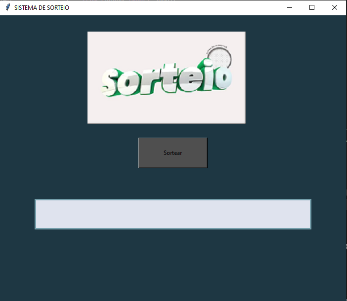

  
 
  
## Aplicação simples de sorteio

  Projeto de uma aplicação em python de um sistema simples de sorteio, usando o algoritmo de árvore minínma(AGM). Ao executar um botão, faz-se o sorteio de 5 números aleatório que é gerado pelo módulo Random da linguagem. 
  Além disso, outro recurso muito legal é também, a aplicação da  biblioteca Tkinter, que é usada para dá ênfase de um mini-aplicativo desenvolvido na linguagem de programação - Python.

